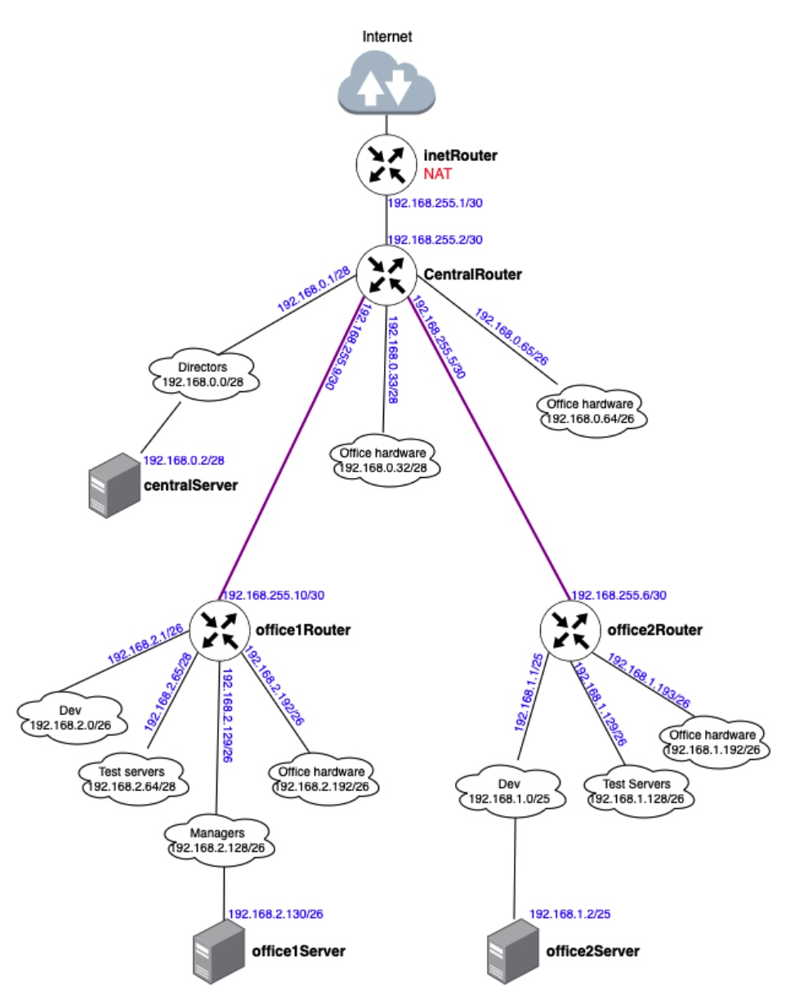

# Архитектура сети

* [Как начать Git](git_quick_start.md)
* [Как начать Vagrant](vagrant_quick_start.md)

## Цель
- Соединить офисы в сеть согласно логической схеме и настроить роутинг
- Интернет-трафик со всех серверов должен ходить через inetRouter
- Все сервера должны видеть друг друга (должен проходить ping)
- У всех новых серверов отключить дефолт на NAT (eth0), который vagrant поднимает для связи
- Добавить дополнительные сетевые интерфейсы, если потребуется


Используйте этот [Vagrantfile](Vagrantfile) - для тестового стенда.  

Изучив таблицу топологии сети и Vagrant-стенд из задания, мы можем построить полную схему сети:  


### Настройка NAT
Для того, чтобы на всех серверах работал интернет, на сервере inetRouter должен быть настроен NAT. В нашем Vagrantfile он настраивался с помощью команды: 
```iptables -t nat -A POSTROUTING ! -d 192.168.0.0/16 -o eth0 -j MASQUERADE```
При настройке NAT таким образом, правило удаляется после перезагрузки сервера. Для того, чтобы правила применялись после перезагрузки, в Ubuntu 22.04 нужно выполнить следующие действия:
1) Подключиться по SSH к хосту: ```vagrant ssh inetRouter```
2) Проверить, что отключен другой файервол: ```systemctl status ufw```
root@inetRouter:~# systemctl status ufw  
● ufw.service - Uncomplicated firewall  
     Loaded: loaded (/lib/systemd/system/ufw.service; enabled; vendor preset: enabled)  
     Active: active (exited) since Sat 2023-10-14 15:48:04 UTC; 7min ago  
       Docs: man:ufw(8)  
   Main PID: 517 (code=exited, status=0/SUCCESS)  
        CPU: 3ms  
  
Если служба будет запущена, то нужно её отключить и удалить из автозагрузки:
```systemctl stop ufw```
```systemctl disable ufw```

