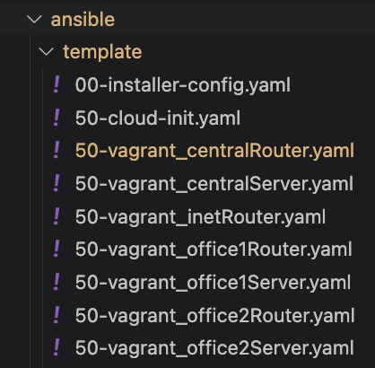

# Архитектура сети

* [Как начать Git](git_quick_start.md)
* [Как начать Vagrant](vagrant_quick_start.md)

## Цель
- Соединить офисы в сеть согласно логической схеме и настроить роутинг
- Интернет-трафик со всех серверов должен ходить через inetRouter
- Все сервера должны видеть друг друга (должен проходить ping)
- У всех новых серверов отключить дефолт на NAT (eth0), который vagrant поднимает для связи
- Добавить дополнительные сетевые интерфейсы, если потребуется
  
Используйте этот [Vagrantfile](Vagrantfile) - для тестового стенда.  
  
Изучив таблицу топологии сети и Vagrant-стенд из задания, мы можем построить полную схему сети:  


### Настройка NAT
Чтобы на всех серверах работал интернет, на сервере inetRouter должен быть настроен NAT.  
  
Для этого в playbook добавим следующие команды:   
  - name: Set up NAT on inetRouter  
    template:   
      src: "{{ item.src }}"  
      dest: "{{ item.dest }}"  
      owner: root  
      group: root  
      mode: "{{ item.mode }}"  
    with_items:  
      - { src: "iptables_rules.ipv4", dest: "/etc/iptables_rules.ipv4", mode: "0644" }  
      - { src: "iptables_restore", dest: "/etc/network/if-pre-up.d/iptables", mode: "0755" }  
    when: (ansible_hostname == "inetRouter")  
  
  
Модуль template копирует 2 файла, которые были указаны выше. Для файла /etc/network/if-pre-up.d/iptables уже установлен атрибут выполнения файла.  

### Настройка маршрутизации транзитных пакетов с помощью Ansible
  
  В Ansible есть специальный блок для внесений изменений в параметры ядра:  
  - name: set up forward packages across routers  
    sysctl:  
      name: net.ipv4.conf.all.forwarding  
      value: '1'  
      state: present  
    when: "'routers' in group_names"  
  
В условии указано, что изменения будут применяться только для группы «routers», которая создана в hosts-файле.  
  
### Отключение маршрута по умолчанию с помощью Ansible
  
Для выполнения идентичных изменений с помощью Ansible, можно воспользоваться следующим блоком:  
  - name: disable default route  
    template:   
      src: 00-installer-config.yaml  
      dest: /etc/netplan/00-installer-config.yaml  
      owner: root  
      group: root  
      mode: 0644  
    when: (ansible_hostname != "inetRouter")   
  
### Настройка маршрутов с помощью Ansible
  
Для настройки маршрутов с помощью Ansible, нам необходимо подготовить файлы 50-vagrant.yaml с маршрутами для всех серверов. Далее с помощью модуля template мы можем их добавлять:  
  
  - name: add default gateway for centralRouter  
    template:   
      src: "50-vagrant_{{ansible_hostname}}.yaml"  
      dest: /etc/netplan/50-vagrant.yaml  
      owner: root  
      group: root  
      mode: 0644  
  
  - name: restart all hosts  
    reboot:  
      reboot_timeout: 600  
    
Для того, чтобы не писать 7 идентичных модулей, можно сделать один модуль, в котором будут перечисляться все хосты. Для этого у template-файлов должны быть идентичные имена формата 50-vagrant_<имя сервера>.yaml  
Например:  

  
После запуска стенда с помощью команды: ``` vagrant up ```
необходимо запустить автоматизированную настройку виртуальных машин с помощью Ansible. Для чего требуется выполнить команду ```ansible-playbook ./ansible/playbook.yml -i ./ansible/hosts.ini```
По удачному завершению настройки стенда, можно проверить доступность интернет на серверах: centralServer, office1Server и office2Server


